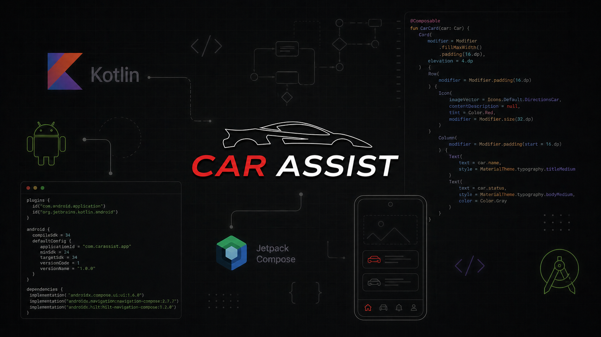

# Car-Assist-Mobile

Empresa especializada no desenvolvimento de aplicações voltadas para o setor automotivo, com foco na gestão, monitoramento e manutenção de veículos.

## Repositório

- [Principal](https://github.com/Bre01cc/Car-Assist)

## Sobre
Este repositório é destinado ao desenvolvimento mobile da aplicação **Car Assist**. Nele estão centralizados o código-fonte do projeto, a organização estrutural das pastas, screens, models, views e viewsModels. Seu objetivo é garantir uma base organizada, escalável e eficiente para o aplicativo.

## Tecnologias
| Tecnologia | Versão |
|------------|--------|
| | |

## Pré-requisitos

 ## Instalação 

## Estrutura do Projeto
- 📁 `components/`

- 📁 `navigation/`

- 📁 `screen/`
 
- 📁 `ui/`

## Descrição das Pastas
### assets
Diretório responsável por armazenar arquivos estáticos utilizados no projeto, como logos, imagens e outros recursos visuais.

### components
Diretório responsável por armazenar componentes reutilizáveis da interface, como barras de navegação, botões personalizados, cards e demais elementos visuais compartilhados entre diferentes telas do aplicativo.

### navigation
Diretório responsável por concentrar a configuração de navegação da aplicação, definindo rotas, telas disponíveis e o fluxo de transição entre as páginas do app.

### screen
Diretório responsável por armazenar as telas principais da aplicação. Cada subpasta representa uma funcionalidade específica do sistema, contendo layouts, lógica visual e recursos relacionados à respectiva tela.

### ui
Diretório responsável por concentrar configurações visuais globais da aplicação, como paleta de cores, temas, tipografia e padronização da identidade visual.

## Autores
- [@Breno Reis](https://github.com/Bre01cc)
- [@Guilherme Moreira](https://github.com/Guilherme1108)
- [@Gustavo Mathias](https://github.com/Gustaxsx)
- [@Nikolas](https://github.com/nikolasfernnds)
